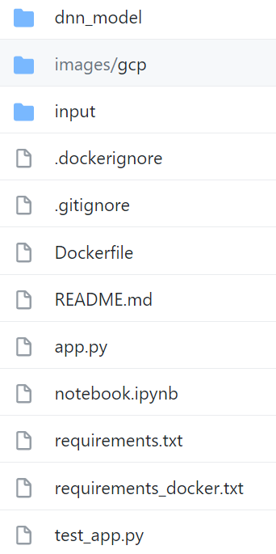
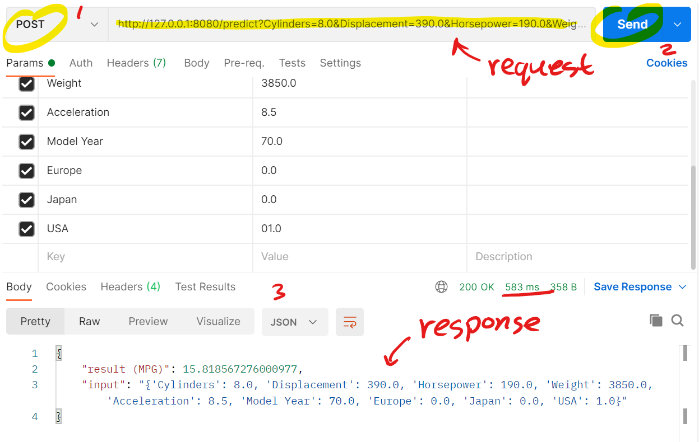
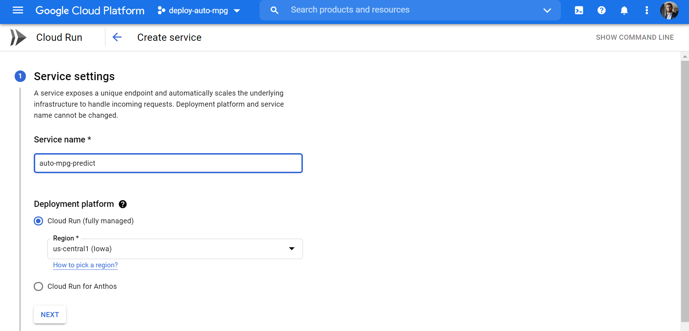
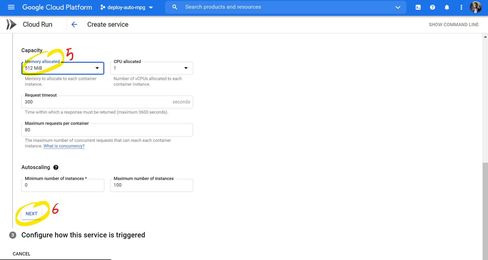
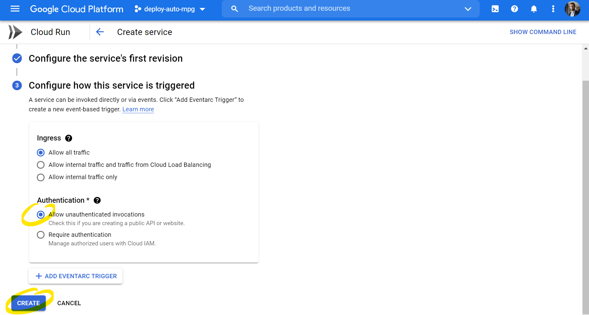
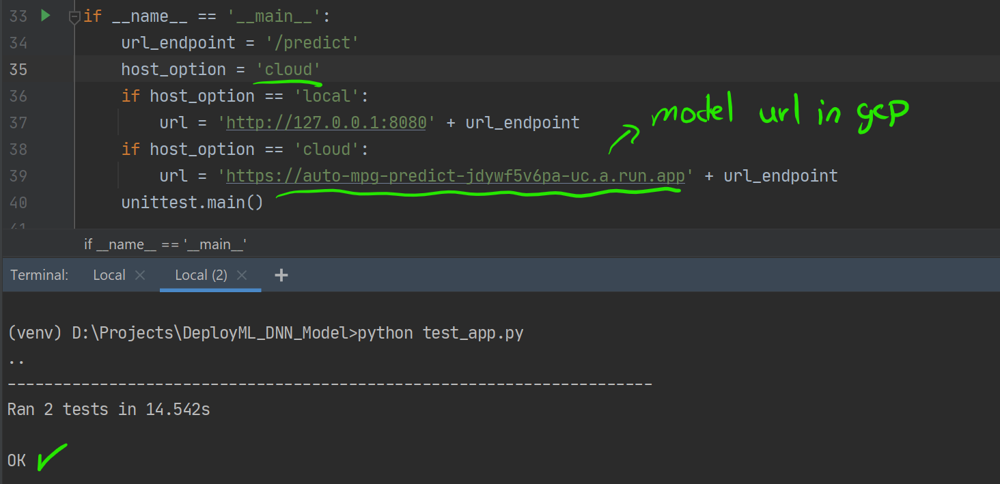

# Deploy a ML Model

## Introduction
This project is an example for deploying ML models using `Python 3` with Docker containers and unit testing. This README explains the project with a tutorial that should help the reader to learn how to deploy ML models in the cloud. This project was developed in `Python 3.6.8` using PyCharm. 

To deploy a ML model we essentially need two components: a trained ML model and an API to communicate with this model. These two components can then be containerized in a docker container and later deployed in the cloud. Therefore, the process of deploying a ML model can be explained in these 4 steps:
1. Developing a ML Model.
2. Designing an API for the ML Model (with Unit Testing).
3. Build a Docker Image that Includes both the Model and the API. 
4. Uploading the Docker Image in the Cloud for Deployment. 

For now, the selected ML model is deployed in Google Cloud Platform (GCP). However, in future, other cloud platforms will be included such as Microsoft Azure and Amazon Web Services (AWS).

To get started with this project, you need first to clone the repository to your working directory using git:

`git clone https://github.com/zakgrin/Deploy_ML_Model.git`

__Note:__ if you find this project useful in anyway, please do not forget to give it a start.

## Project Folder
The project contains the following list: 

- [dnn_model](dnn_model): tensorflow model folder.
- [images](images): documentation images.
- [input](input): input data to test the model.
- [.dockerignore](.dockerignore): files to ignore in docker image building.
- [.gitignore](.gitignore): files to ignore in git.
- [app.py](app.py): API application (main python file).
- [Dockerfile](Dockerfile): docker file to build a docker image.
- [notebook.ipynb](notebook.ipynb): a notebook for a short example for model loading and prediction.
- [README.md](README.md): this documentation.
- [requirements.txt](requirements.txt): python venv requirements.
- [requirements_docker.txt](requirements_docker.txt): docker image requirements.
- [test_app.py](test_app.py): unit testing for the API application. 

<!--comment-->
<!---->

## Step 1. Developing a ML Model
Developing a ML model is not the focus of this tutorial and for this reason a pretrained model was selected. In this project, a tensorflow DNN model to predict Auto MPG was used ([Basic regression: Predict fuel efficiency](https://www.tensorflow.org/tutorials/keras/regression), this tutorial shows how to get started with tensorflow to develop a basic deep neural network (DNN) regression model). The same procedure can be followed to train and save tensorflow models using `model.save('model')`. 

Before deploying or using any ML model, it is strongly recommended to understand the data input and output of the model. For our simple model, [notebook](notebook.ipynb) provides the minimum understanding to perform predictions. 

Deploying a model is the focus of this documentation as well be explained in the following sections. This process starts with the API design (Step 2) and ends with the model deployment in the cloud (Step 4). The same steps can be repeated to maintain or improve the model (Step 5).

## Step 2. Designing an API for the ML Model (with Unit Testing)

### Designing an API
To deploy a model, we need to establish a way of communication with this model using an API as shown in [app.py](app.py). This file includes a simple flask application with restfull API with a single entry point. Since we are deploying a ML model the entry point is called `predict`. 

The `predict` entry point provides two http requests which are `get` and `post`. The first (`get`) provides a text output with a `200` as an OK http code to confirm the communication with the model. The second (`post`) is used to send the input to the model and provide the prediction as an output.

### Run and Test The API
Now that we have both a model and an API, we are ready to run and test them. At the beginning, we need to test our API in python to make sure that everything is in place before we can move further to docker (Step 3) and finally to GCP (Step 4).

If you want to run the API application in your local machine using python, navigate to the project folder and create a new python venv. After that, you can follow these steps: 

- Run pip install command: `pip install -r requirements.txt`
- Run the python API app: `python app.py` 

    

- To test `/predict` entry point, open the url in a web browser (ends with `/predict`): `http://127.0.0.1:8080/predict`

    
    - (This show that the API can successfully respond to http get requests).
    
- This API is meant to provide predictions to http post requests. The post request should be in the following format as shown in this example: 
    - `http://127.0.0.1:8080/predict?Cylinders=8.0&Displacement=390.0&Horsepower=190.0&Weight=3850.0&Acceleration=8.5&Model Year=70.0&Europe=0.0&Japan=0.0&USA=01.0`
    
    - To send a post request, you can use [Postman](https://www.postman.com/downloads/) or `request` module in Python. The following image shows a post request by Postman with the API response: 
    
    
    - (It can be noted that it took about 583ms for the API to provide a response).
 
- The unit testing for this API is based on `request` module in python. To run the API unit test: 
    - check [test_app.py](test_app.py) and make sure that `host_option = 'local'`
    - run the test using `python test_app.py`
    - make sure that you keep `app.py` working to be able to test it!
    
        
        - (This shows that the API responded as expected to http `get` and `post` requests).
        
    - to see the unit testing program, read [test_app.py](test_app.py).

## Step 3. Build a Docker Image that Includes both the Model and the API
It is important to replicate the API using a docker container which will allow us to deploy it in the cloud. To confirm that a docker container can replicate the expected procedure, then it should pass the same test as we did directly with python. Therefore, the [test_app.py](test_app.py) was designed to test both options using `local` as a host option. Note that the container uses the same url and port number as when you run the application directly with python. 

You can use [Dockerfile](Dockerfile) to build a docker image with `docker build` command. The following commands were used: 
- `docker build -t auto-mpg-docker .`: to build the docker image.
- `docker images` or `docker image ls -a`: to show current docker images.
- `docker rmi deploy-auto-mpg` or `docker image rm deploy-auto-mpg`: to remove a docker image.
    - (You can use the first few letters in the image ID instead of the name).
- `docker run -p 8080:8080 --name predict -d auto-mpg-docker`: to run the docker image using the same port as the host.
- `docker ps -a` or `docker container ls -a`: to show all current docker processes.
- `docker stop predict` or `docker container stop predict`: to stop the docker process.
- `docker start predict` or `docker container start predict`: to start the docker process.
- `docker rm predict` or `docker container rm predict`: to remove the docker process.

After building the image and running the container under `predict` name, we can run [test_app.py](test_app.py) using python as we did before. Make sure that `host_option='local'`before you run the test. To confirm that the model is running as expected within the container, `python test_app.py` should also provide `OK` test. Now that our container is ready, we can deploy it in the cloud.

## Step 4. Uploading the Docker Image in the Cloud for Deployment

### Google Clout Platform (GCP)
To be able to use GCP, a google account is needed to create a new project. The following 5 steps show the process from starting a new project to running the model in GCP and performing a unit testing from a local machine.

1. __Creating a new project in GCP__:
    - Open [GCP Console](https://console.cloud.google.com/).
    - Create a new project with the following name: `deploy-auto-mpg`.
    - Enable API for the project in [GCP Enable API](https://console.cloud.google.com/flows/enableapi?apiid=cloudbuild.googleapis.com)
2. __Google Cloud SDK Setup__:
    - Install [GCP SDK](https://cloud.google.com/sdk/docs/install) and then run the Google Cloud SDK shell. Follow the instruction to authenticate your Google account and also select your GCP project. 
    - You can also add docker configuration based on the region (or the registry name). 
        - This file is located [C:\Users\<UserName>\.docker\config.json] can can be configured with `gcloud auth configure-docker`. 
        - It is recommended to include the region name otherwise all GCP regions will be configured with docker.
        - To configure europe: `gcloud auth configure-docker gcr.io`.
        - Other regions include: 
        `{
          "credHelpers": {
            "gcr.io": "gcloud",
            "us.gcr.io": "gcloud",
            "eu.gcr.io": "gcloud",
            "asia.gcr.io": "gcloud",
            "staging-k8s.gcr.io": "gcloud",
            "marketplace.gcr.io": "gcloud"
          }
        }`.
3. __Uploading Docker Image to GCP__:
    - Use the following command in Google Cloud SDK Shell at the project directory were [Dockerfile](Dockerfile) is located: `gcloud builds submit --tag gcr.io/deploy-auto-mpg/auto-mpg-docker`. This command will build a docker Image and submit it to `gcr.io` registry under `deploy-auto-mpg` project and using the `auto-mpg-docker` docker container. 
    - After a successfully running the previous command, the following message should appear:
    
    - Go to [GCP Console](https://console.cloud.google.com/) to show this new Docker image added under __Container Registry__:
    
    
4. __Creating a Service in GCP__:
    - To start using the model in the cloud, we have to create a service using __Cloud Run__. The following images shows how to create a new service named `auto-mpg-predict` using the docker image `auto-mpg-docker` within`deploy-auto-mpg` project:
    
        
        
        
        
        
        

5. __Test the model__:
    - To test the get request, simply copy the model url and add `/predict`:    
        
        (This shows a successful get request)
    - You can use the unit test [test_app.py](test_app.py) to test the model but you need to update `url` and to set the `host option='cloud`:
        
        (This shows a successful unit test for the model in GCP)
     

## Credits
Thanks to Metro Digital for encouraging me to work on this project. 

## References
- Tensorflow Tutorial:
    - [Basic regression: Predict fuel efficiency](https://www.tensorflow.org/tutorials/keras/regression)
- Python API Tutorials:
    - [The Right Way to Build an API with Python](https://towardsdatascience.com/the-right-way-to-build-an-api-with-python-cd08ab285f8f)
- Python Unit Testing:
    - [Python Tutorial: Unit Testing Your Code with the unittest Module](https://www.youtube.com/watch?v=6tNS--WetLI)
- Docker Tutorials:
    - [Docker Get Started](https://docs.docker.com/get-started/)
    - [Deploy APIs With Python and Docker](https://towardsdatascience.com/deploy-apis-with-python-and-docker-4ec5e7986224)
    - [How To Remove Docker Images, Containers, and Volumes](https://www.digitalocean.com/community/tutorials/how-to-remove-docker-images-containers-and-volumes#:~:text=Remove%20all%20images,docker%20images%20%2Da)
